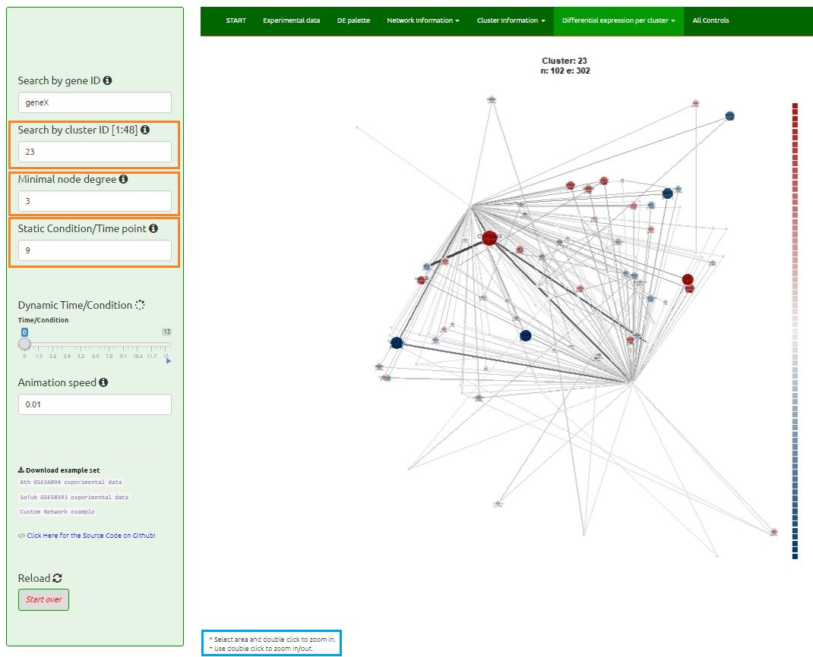
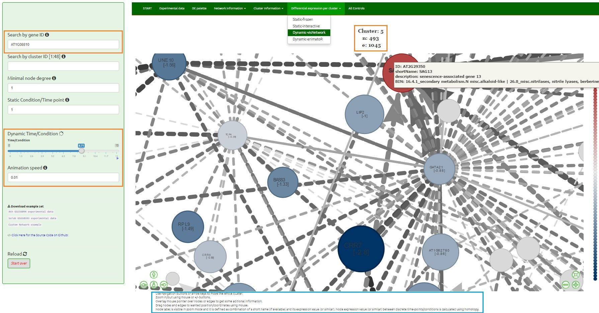

 

Visualisation of experimental data in background knowledge in particular cluster.

<i>Note: for a bigger image use right click -> View Image -> Zoom</i>

 

<h3 id="Static-frozen">7.1. Static-frozen</h3>

Static graph of selected cluster overlaid with experimental values per selected time-point/condition. One can easily browse through different data files (different time-points/conditions) by simply using scroll wheel or arrow keys. For 'clearer' view of few nodes in a cluster, select the area of interest and use double-click to zoom in.
 
 

 

 

<h3 id="Static-interactive">7.2. Static-interactive</h3>

Static graph of selected cluster overlaid with experimental values per selected time-point/condition. One can easily browse through different data files by simply using scroll wheel or arrow keys.

In contrast to previous options, this one allows highly interactive network visualization:

* Use navigation buttons or arrow keys to move the whole cluster.
* Zoom in/out using mouse or +/- buttons.
* Overlay mouse pointer over nodes or edges to get some aditional information.
* Drag nodes and edges to wanted position/coordinates using mouse.
* Select node and its neighbors by label using >>Select by id option<<. Keyboard entry is also enabled, meaning one can start typing wanted label in the 'green window' and select wanted one by hitting the Enter key. Node label is defined as combination of a short name (if available) and its expression value (or similar) in discrete time-point/condition.

| reaction types   | arrow position       | line type            |
| ---------------- | -------------------- | -------------------- |
| 'binding' | from;middle;to | dashed |
| 'unk_TF' | none | dashed |
| 'activation' | middle;to | full |
| 'act_TF' | middle;to | full |
| 'inhibition' | none | full |
| 'synthesis' | none | dashed |
| 'inh_TF' | none | full |
| 'inh_ncRNA' | none | full |
| '-' | none | dashed |
| <i>>something else<</i> | if the word contains "act": middle;to, else: none | if the word contains "act" or "inh": full, else: dashed |

Click on the button <button><b>Download .html</b></button> to save visNetwork object to a HTML file.

 
 

 

 

<h3 id="Dynamic-vis">7.3. Dynamic-vis</h3>

Animation of selected cluster overlaid with experimental values for all consecutive conditions/time-points. Start the animation by using the Dynamic Visualisation Control slider.

* Use navigation buttons or arrow keys to move the whole cluster.
* Zoom in/out using mouse or +/- buttons.
* Overlay mouse pointer over nodes or edges to get some aditional information.
* Drag nodes and edges to wanted position/coordinates using mouse.
* Node label is visible in zoom mode and it is defined as combination of a short name (if available) and its expression value (or similar). Node expression value (or similar) between discrete time-points/conditions is calculated using homotopy.

| reaction types   | arrow position       | line type            |
| ---------------- | -------------------- | -------------------- |
| 'binding' | from;middle;to | dashed |
| 'unk_TF' | none | dashed |
| 'activation' | middle;to | full |
| 'act_TF' | middle;to | full |
| 'inhibition' | none | full |
| 'synthesis' | none | dashed |
| 'inh_TF' | none | full |
| 'inh_ncRNA' | none | full |
| '-' | none | dashed |
| <i>>something else<</i> | if the word contains "act": middle;to, else: none | if the word contains "act" or "inh": full, else: dashed |

 

 

 

<h3 id="Dynamic-animatoR">7.4. Dynamic-animatoR</h3>

Animation of selected cluster overlaid with experimental values for all consecutive conditions/time-points. Start the animation by using the Dynamic Visualisation Control slider.

Click on the button <button><b>Create dynamic .html</b></button> to render out a web-based animation of a networkDynamic object using ndtv-d3 player app. Generated file can be downloaded as a HTML file.

 

Click on the button <button><b>Download static image</b></button> to create static image of the cluster in the preferred condition/time-point. Generated file is downloaded as a PDF or PNG file (dependent upon which option is selected).

 
 

