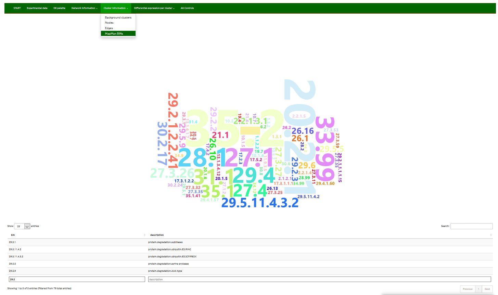

 

<h3 id="Background-cluster">4.1. Background cluster</h3>

Interactive 'graph' of selected cluster, including node and edge information.

Click-drag to zoom, shift-click to pan, double-click to autoscale.
 
 

 

<h3 id="Nodes">4.2. Nodes</h3>

Tabular display of node related information per selected cluster or node ID.
 
 

  1. geneID: geneID.
  2. shortDESCRIPTION: gene description.
  3. shortNAME: gene short name.
  4. MapManBIN: MapMan bins to which gene balongs to.
  5. networkNodeDEGREE: simplified (without loops and multiple reactions) gene degree/valency (the number of edges incident to the vertex) within the complete network.
  6. superCluNodeDEGREE: gene degree/valency (the number of edges incident to the vertex) within the super cluster.
     Identical to cluNodeDEGREE if only 'one round' of clustering was executed.
  7. cluNodeDEGREE: gene degree/valency (the number of edges incident to the vertex) within the cluster.
  8. GENEsuperCluster: super cluster ID.
  9. GENEcluster: cluster ID.

 

<h3 id="Edges">4.3. Edges</h3>

Tabular display of edge related information per selected cluster.
 
 

All edges within the selected cluster and between selected cluster and any other clusters are shown.
Node degree on a network level is used in filtering.

  1. STARTgene: geneID at which the edge begins.
  2. ENDgene: geneID at which the ends.
  3. reactionTYPE: type of reaction.
  4. STARTcluster: no. of the cluster the STARTgene belongs to.
  5. ENDcluster: no. of the cluster the ENDgene belongs to.
     These two are identical if both nodes are within the same cluster.
  6. STARTsuperClu and ENDsuperClu: no. of the super cluster start/end vertex was a memeber of before further split.
  7. netSTARTnodeDegree: STARTgene degree/valency (the number of edges incident to the vertex) within the complete network.
  8. netENDnodeDegree: ENDgene degree/valency (the number of edges incident to the vertex) within the complete network.
  9. superCluSTARTnodeDegree, superCluENDnodeDegree, cluSTARTnodeDegree and cluENDnodeDegree: START/ENDgene degree within the (super) cluster.

 

<h3 id="subnetwork-MapMan-bins">4.4. subnetwork MapMan bins</h3>

Word cloud of node MapMan bins in a selected network per selected cluster.
Place a mouse over interesting bin to get the frequency.
Find description of a bin in the table below.
 

