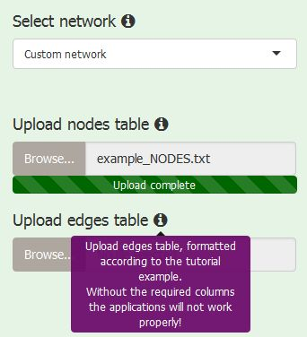

 

For DiNAR to work appropriately, Custom Network (CN) should have the same format as the LKNs.

The first prerequisite are the clusters of appropriate size for visualisation.

Second, non-overlapping two-dimensional coordinates/layout for corresponding nodes must be provided.

In the case CN is selected, one needs to upload:

* table containing nodes/genes information

* table containing edges/reactions information

 
 
 

 

 
The files should be in the tab-separated format with the following column names (header):

   

* nodes file

 

 

    geneID - containing node IDs /gene identifiers
    shortDescription - short node/gene description 
                       (in the case of missing information fill with '-')
    shortName - short node/gene name 
                (in the case of missing information fill with '-')
    MapManBin - node/gene MapMan bin 
                (in the case of missing information fill with '-')
    superClusterID - node affiliation to a super cluster 
                     (in the case of missing information fill with 1)
    clusterID - node affiliation to a cluster
    x - x coordinate of a node
    y - y coordinate of a node
    networkSimplifiedNodeDegree - node degree within the simplified network 
                                  (in the case of missing information fill with 1)
    superClusterSimplifiedNodeDegree - node degree within the super cluster 
                                       (in the case of missing information fill with 1)
    clusterSimplifiedNodeDegree - node degree within the cluster 
                                  (in the case of missing information fill with 1)
    expressed - dummy variable (fill with 1)

      

* edges file

 

 

    geneID1 - source node/gene ID
    geneID2 - target node/gene ID
    reactionType - interaction type (string, e.g.: binding, activation, inhibition, '-', ...)
    clusterID_geneID1 - source node affiliation to a cluster
    clusterID_geneID2 - target node affiliation to a cluster
    superClusterID_geneID1 - source node affiliation to a super cluster 
                             (in the case of missing information fill with '-')
    superClusterID_geneID2 - target node affiliation to a super cluster 
                             (in the case of missing information fill with '-')
    networkSimplifiedNodeDegree_geneID1 - source node degree within the simplified network 
                                          (in the case of missing information fill with 1)
    networkSimplifiedNodeDegree_geneID2 - target node degree within the simplified network 
                                          (in the case of missing information fill with 1)
    superClusterSimplifiedNodeDegree_geneID1 - source node degree within the super cluster 
                                               (in the case of missing information fill with 1)
    superClusterSimplifiedNodeDegree_geneID2 - target node degree within the super cluster 
                                               (in the case of missing information fill with 1)
    clusterSimplifiedNodeDegree_geneID1 - source node degree within the cluster 
                                          (in the case of missing information fill with 1)
    clusterSimplifiedNodeDegree_geneID2 - target node degree within the cluster 
                                          (in the case of missing information fill with 1)
    exists - dummy variable (fill with 1)

   

Additional columns between first and the last one are possible, but will be ignored in DiNAR analysis.

