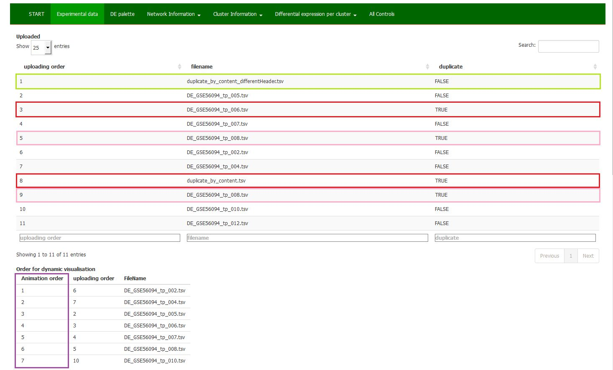

 

Information about the uploaded experimental data files.

Here the list of Uploaded files is visible (Table <b><i>'Uploaded'</i></b>) as well as the selection of files for dynamic visualisation including their order as predefined in the <a href="Select_experimental_files_for_the_analysis_and_define_the_order.html">Select experimental files...</a> (Table <b><i>'Order for dynamic visualisation'</i></b>) in MENU part.

The quality control check-up of uploaded files is performed to prevent any accidental duplication (Column 'duplicate').

Search option: can be used for the check-up of a particular data file.

 

