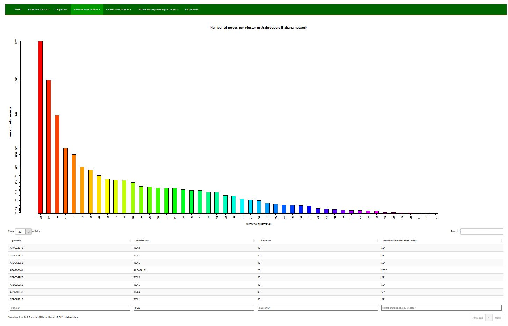
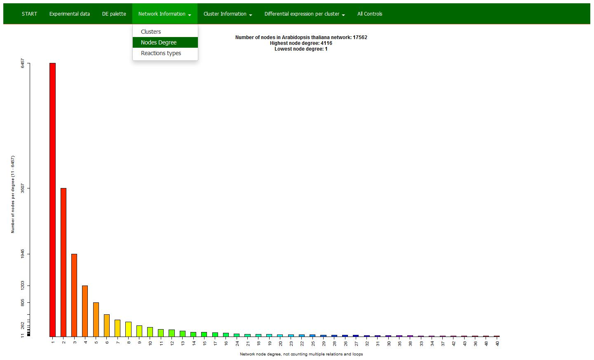

 

Here the information on large knowledge network selected for the analysis is given.

 

<h3 id="Clusters">3.1. Clusters</h3>

* Histogram: number of nodes per cluster in a selected network and
* Table: nodes (geneID and short name) per cluster in a selected network
 

 

<h3 id="Node-Degree">3.2. Node Degree</h3>

Node degree distribution in a selected network.
 

 

<h3 id="Reactions-types">3.3. Reactions types</h3>

Reaction types distribution in a selected network.
 

