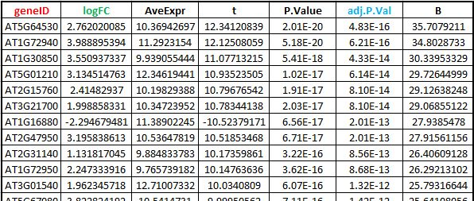

 

 
1. Select column (name) with gene IDs (e.g. geneID). 
2. Select column (name) with outcome of statistical test (e.g. adj.P.Val). 
3. Type in desired threshold to filter nodes based on the statistical test. (e.g. 0.01) 
&nbsp;&nbsp;&nbsp;&nbsp;All the nodes that have value higher of the threshold defined will not be shown in the DiNAR analyses. 
4. Select column (name) with measure of response (change in expression value, e.g. logFC). 
5. Type in cut-off threshold (absolute value) for minimal desired intensity of response. (e.g. 0.8) 
&nbsp;&nbsp;&nbsp;&nbsp;All the nodes that have value in the defined closed interval will not be shown in the DiNAR analyses (e.g. -0.8 < logFC < 0.8). 
&nbsp;&nbsp;&nbsp;&nbsp;Other nodes that meet the criteria will be coloured and scaled according to the values in previously defined column.

 
In the case that some column names contain ID, adj.p.val or logFC, they will be proposed automatically. 

One example of the possible file format is shown below (generated using the Bioconductor <a href="http://www.bioconductor.org/packages/release/bioc/html/limma.html">limma</a>  package).<a name="exampleLimma"</a>

 
